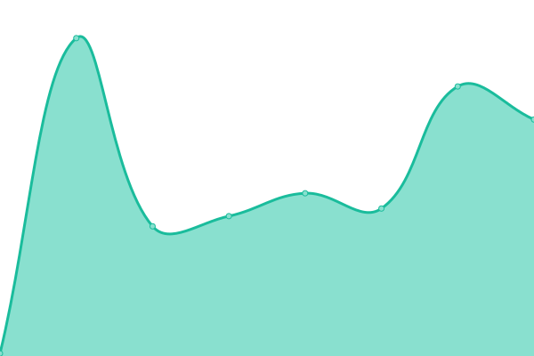
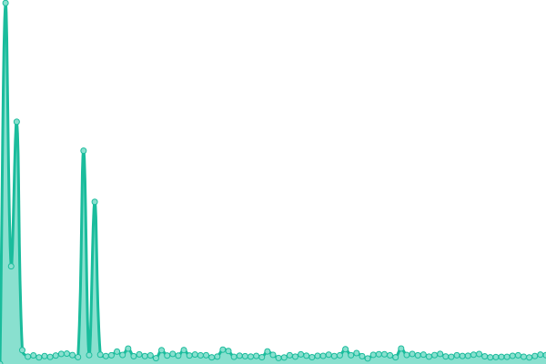

# [📈 Live Status](https://status.duinocoin.com): <!--live status--> **🟧 Partial outage**

This repository contains the open-source uptime monitor and status page for [Duino-Coin](https://duinocoin.com), powered by [Upptime](https://github.com/upptime/upptime).

With [Upptime](https://upptime.js.org), you can get your own unlimited and free uptime monitor and status page, powered entirely by a GitHub repository. We use [Issues](https://github.com/duino-coin/status-page/issues) as incident reports, [Actions](https://github.com/duino-coin/status-page/actions) as uptime monitors, and [Pages](https://status.duinocoin.com) for the status page.

<!--start: status pages-->
<!-- This summary is generated by Upptime (https://github.com/upptime/upptime) -->
<!-- Do not edit this manually, your changes will be overwritten -->
<!-- prettier-ignore -->
| URL | Status | History | Response Time | Uptime |
| --- | ------ | ------- | ------------- | ------ |
|  [Duinocoin.com](https://duinocoin.com) | 🟩 Up | [duinocoin-com.yml](https://github.com/duino-coin/status.duinocoin.com/commits/HEAD/history/duinocoin-com.yml) | 

 107ms
     
 | 

<a href="https://status.duinocoin.com/history/duinocoin-com">47.98%</a>
    

|  [Duino-Coin Server & API](https://server.duinocoin.com) | 🟩 Up | [duino-coin-server-and-api.yml](https://github.com/duino-coin/status.duinocoin.com/commits/HEAD/history/duino-coin-server-and-api.yml) | 

 1974ms
     
 | 

<a href="https://status.duinocoin.com/history/duino-coin-server-and-api">27.09%</a>
    

|  [Duino-Coin Wallet](https://wallet.duinocoin.com) | 🟩 Up | [duino-coin-wallet.yml](https://github.com/duino-coin/status.duinocoin.com/commits/HEAD/history/duino-coin-wallet.yml) | 

 107ms
     
 | 

<a href="https://status.duinocoin.com/history/duino-coin-wallet">100.00%</a>
    

|  [Duino-Coin Explorer](https://explorer.duinocoin.com) | 🟩 Up | [duino-coin-explorer.yml](https://github.com/duino-coin/status.duinocoin.com/commits/HEAD/history/duino-coin-explorer.yml) | 

 128ms
     
 | 

<a href="https://status.duinocoin.com/history/duino-coin-explorer">100.00%</a>
    

|  [Duino-Coin Exchange](https://exchange.duinocoin.com) | 🟩 Up | [duino-coin-exchange.yml](https://github.com/duino-coin/status.duinocoin.com/commits/HEAD/history/duino-coin-exchange.yml) | 

 99ms
     
 | 

<a href="https://status.duinocoin.com/history/duino-coin-exchange">100.00%</a>
    

|  [Duino-Coin BSC Wrapper](https://bsc.duinocoin.com) | 🟩 Up | [duino-coin-bsc-wrapper.yml](https://github.com/duino-coin/status.duinocoin.com/commits/HEAD/history/duino-coin-bsc-wrapper.yml) | 

 155ms
     
 | 

<a href="https://status.duinocoin.com/history/duino-coin-bsc-wrapper">100.00%</a>
    

|  [BeyondFaucet](https://beyondfaucet.com) | 🟥 Down | [beyond-faucet.yml](https://github.com/duino-coin/status.duinocoin.com/commits/HEAD/history/beyond-faucet.yml) | 

 755ms
     
 | 

<a href="https://status.duinocoin.com/history/beyond-faucet">80.92%</a>
    

<!--end: status pages-->

[**Visit our status website →**](https://status.duinocoin.com)

## 📄 License

- Powered by: [Upptime](https://github.com/upptime/upptime)
- Code: [MIT](./LICENSE) © [Duino-Coin](https://duinocoin.com)
- Data in the `./history` directory: [Open Database License](https://opendatacommons.org/licenses/odbl/1-0/)
