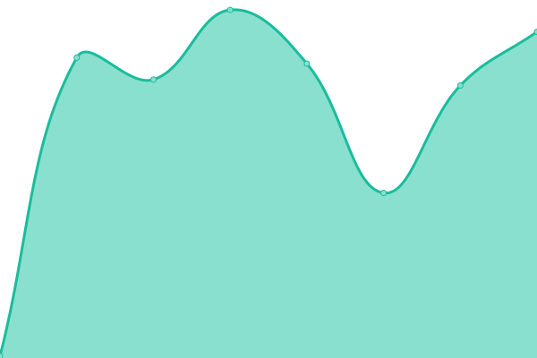
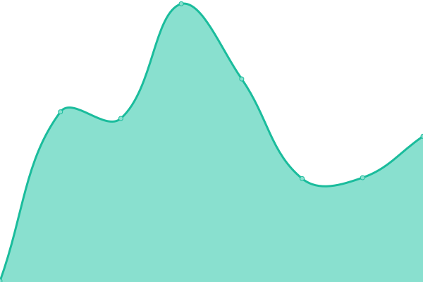
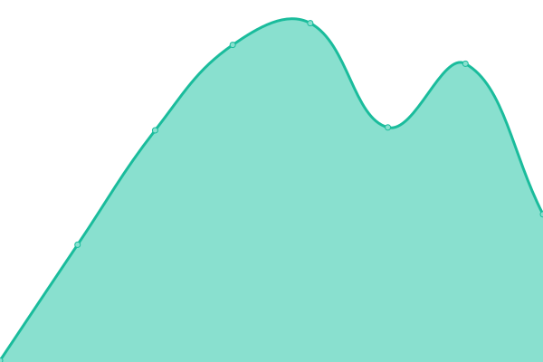
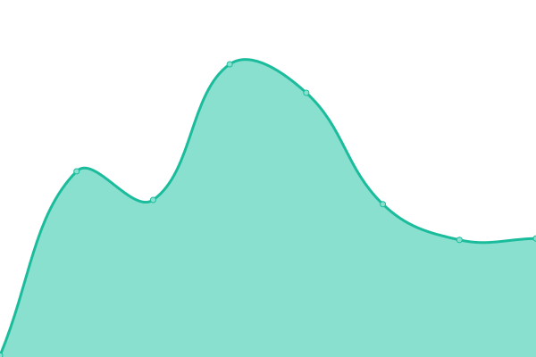
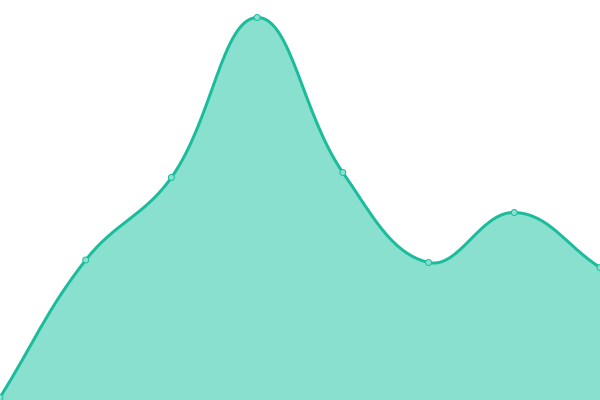

# [📈 Live Status](https://status.duinocoin.com): <!--live status--> **🟩 All systems operational**

This repository contains the open-source uptime monitor and status page for [Duino-Coin](https://duinocoin.com), powered by [Upptime](https://github.com/upptime/upptime).

With [Upptime](https://upptime.js.org), you can get your own unlimited and free uptime monitor and status page, powered entirely by a GitHub repository. We use [Issues](https://github.com/duino-coin/status.duinocoin.com/issues) as incident reports, [Actions](https://github.com/duino-coin/status.duinocoin.com/actions) as uptime monitors, and [Pages](https://status.duinocoin.com) for the status page.

<!--start: status pages-->
<!-- This summary is generated by Upptime (https://github.com/upptime/upptime) -->
<!-- Do not edit this manually, your changes will be overwritten -->
<!-- prettier-ignore -->
| URL | Status | History | Response Time | Uptime |
| --- | ------ | ------- | ------------- | ------ |
|  [Homepage](https://duinocoin.com) | 🟩 Up | [homepage.yml](https://github.com/duino-coin/status.duinocoin.com/commits/HEAD/history/homepage.yml) | 

 134ms
     
 | 

<a href="https://status.duinocoin.com/history/homepage">100.00%</a>
    

|  [Masternodes](https://server.duinocoin.com/api.json) | 🟩 Up | [masternodes.yml](https://github.com/duino-coin/status.duinocoin.com/commits/HEAD/history/masternodes.yml) | 

 180ms
     
 | 

<a href="https://status.duinocoin.com/history/masternodes">100.00%</a>
    

|  [APIs](https://server.duinocoin.com/statistics) | 🟩 Up | [ap-is.yml](https://github.com/duino-coin/status.duinocoin.com/commits/HEAD/history/ap-is.yml) | 

 529ms
     
 | 

<a href="https://status.duinocoin.com/history/ap-is">100.00%</a>
    

|  [Web Wallet](https://wallet.duinocoin.com) | 🟩 Up | [web-wallet.yml](https://github.com/duino-coin/status.duinocoin.com/commits/HEAD/history/web-wallet.yml) | 

 238ms
     
 | 

<a href="https://status.duinocoin.com/history/web-wallet">100.00%</a>
    

|  [Network stats & explorer](https://explorer.duinocoin.com) | 🟩 Up | [network-stats-and-explorer.yml](https://github.com/duino-coin/status.duinocoin.com/commits/HEAD/history/network-stats-and-explorer.yml) | 

 188ms
     
 | 

<a href="https://status.duinocoin.com/history/network-stats-and-explorer">100.00%</a>
    

|  [DUCO Exchange](https://exchange.duinocoin.com) | 🟩 Up | [duco-exchange.yml](https://github.com/duino-coin/status.duinocoin.com/commits/HEAD/history/duco-exchange.yml) | 

 154ms
     
 | 

<a href="https://status.duinocoin.com/history/duco-exchange">100.00%</a>
    

|  [BSC Wrapper](https://bsc.duinocoin.com) | 🟩 Up | [bsc-wrapper.yml](https://github.com/duino-coin/status.duinocoin.com/commits/HEAD/history/bsc-wrapper.yml) | 

 186ms
     
 | 

<a href="https://status.duinocoin.com/history/bsc-wrapper">100.00%</a>
    

|  [Magi by Duino-Coin](https://magi.duinocoin.com) | 🟩 Up | [magi-by-duino-coin.yml](https://github.com/duino-coin/status.duinocoin.com/commits/HEAD/history/magi-by-duino-coin.yml) | 

 153ms
     
 | 

<a href="https://status.duinocoin.com/history/magi-by-duino-coin">100.00%</a>
    

|  [Magi API](https://magi.duinocoin.com/statistics) | 🟩 Up | [magi-api.yml](https://github.com/duino-coin/status.duinocoin.com/commits/HEAD/history/magi-api.yml) | 

 78ms
     
 | 

<a href="https://status.duinocoin.com/history/magi-api">100.00%</a>
    

|  Unipoolia Node 1 | 🟩 Up | [unipoolia-node-1.yml](https://github.com/duino-coin/status.duinocoin.com/commits/HEAD/history/unipoolia-node-1.yml) | 

 118ms
     
 | 

<a href="https://status.duinocoin.com/history/unipoolia-node-1">100.00%</a>
    

|  Unipoolia Node 2 | 🟩 Up | [unipoolia-node-2.yml](https://github.com/duino-coin/status.duinocoin.com/commits/HEAD/history/unipoolia-node-2.yml) | 

 119ms
     
 | 

<a href="https://status.duinocoin.com/history/unipoolia-node-2">100.00%</a>
    

|  JPX Node 1 | 🟩 Up | [jpx-node-1.yml](https://github.com/duino-coin/status.duinocoin.com/commits/HEAD/history/jpx-node-1.yml) | 

 117ms
     
 | 

<a href="https://status.duinocoin.com/history/jpx-node-1">100.00%</a>
    

|  DarkHunter Node | 🟩 Up | [dark-hunter-node.yml](https://github.com/duino-coin/status.duinocoin.com/commits/HEAD/history/dark-hunter-node.yml) | 

 159ms
     
 | 

<a href="https://status.duinocoin.com/history/dark-hunter-node">100.00%</a>
    

|  Gubiani Node 1 | 🟩 Up | [gubiani-node-1.yml](https://github.com/duino-coin/status.duinocoin.com/commits/HEAD/history/gubiani-node-1.yml) | 

 140ms
     
 | 

<a href="https://status.duinocoin.com/history/gubiani-node-1">100.00%</a>
    

|  MCJohn Node 1 | 🟩 Up | [mc-john-node-1.yml](https://github.com/duino-coin/status.duinocoin.com/commits/HEAD/history/mc-john-node-1.yml) | 

 122ms
     
 | 

<a href="https://status.duinocoin.com/history/mc-john-node-1">100.00%</a>
    

|  MCJohn Node 2 | 🟩 Up | [mc-john-node-2.yml](https://github.com/duino-coin/status.duinocoin.com/commits/HEAD/history/mc-john-node-2.yml) | 

 130ms
     
 | 

<a href="https://status.duinocoin.com/history/mc-john-node-2">100.00%</a>
    

|  MCJohn USE Node 1 | 🟩 Up | [mc-john-use-node-1.yml](https://github.com/duino-coin/status.duinocoin.com/commits/HEAD/history/mc-john-use-node-1.yml) | 

 33ms
     
 | 

<a href="https://status.duinocoin.com/history/mc-john-use-node-1">100.00%</a>
    

|  Rust Node 1 | 🟩 Up | [rust-node-1.yml](https://github.com/duino-coin/status.duinocoin.com/commits/HEAD/history/rust-node-1.yml) | 

 128ms
     
 | 

<a href="https://status.duinocoin.com/history/rust-node-1">100.00%</a>
    

<!--end: status pages-->

[**Visit our status website →**](https://status.duinocoin.com)

## 📄 License

- Powered by: [Upptime](https://github.com/upptime/upptime)
- Code: [MIT](./LICENSE) © [Anand Chowdhary](https://anandchowdhary.com), supported by [Pabio](https://pabio.com)
- Data in the `./history` directory: [Open Database License](https://opendatacommons.org/licenses/odbl/1-0/)
